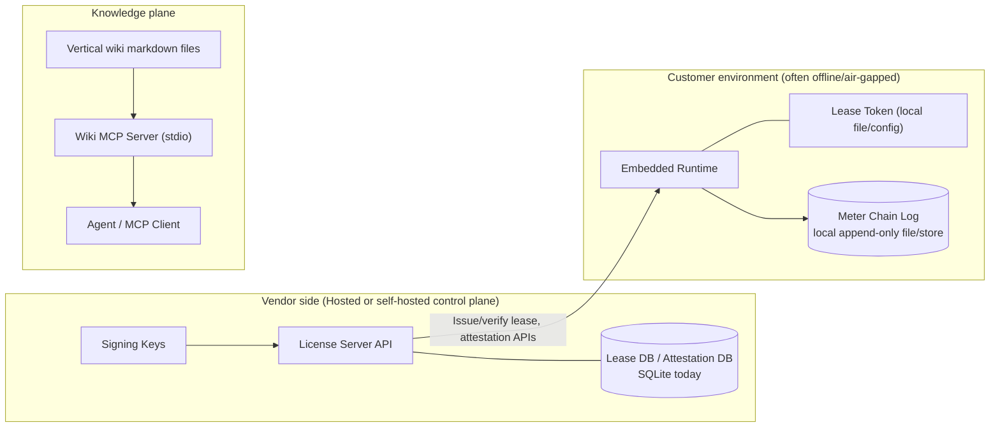
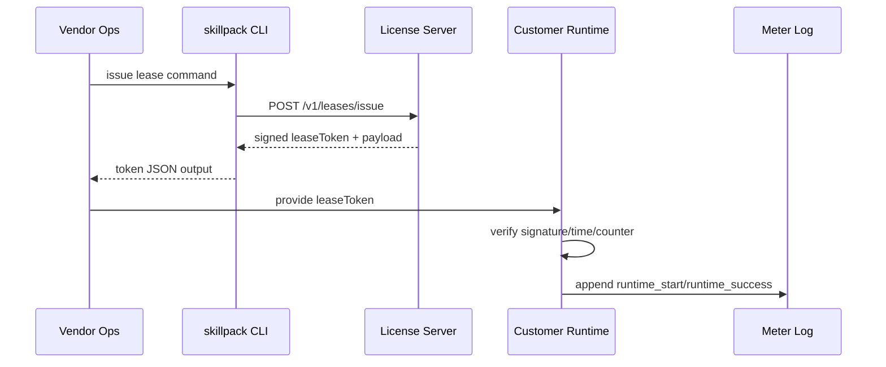
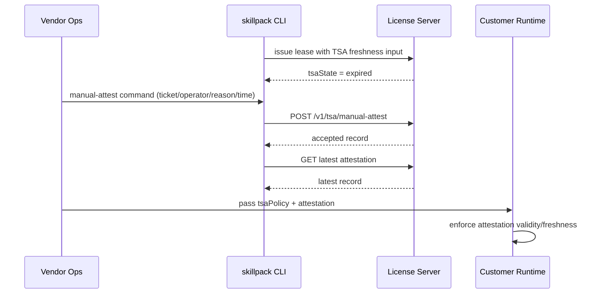
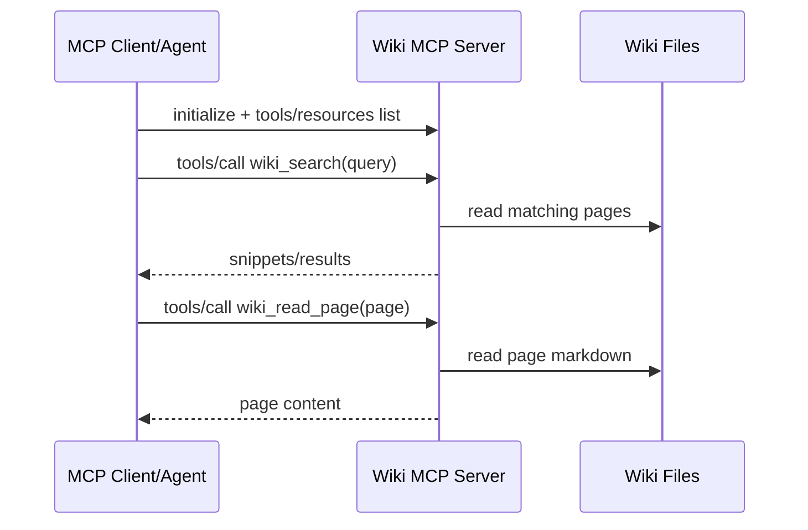

# skillpack (CTO Bird-Eye + Architecture Views)

## What We Are

`skillpack` is the control plane for selling and operating vertical AI skills in regulated/offline environments.

What we do:

- prove skill provenance (signing)
- enforce who can run what and for how long (leases)
- keep tamper-evident usage records (meter chain)
- keep operations running during time-source incidents (manual attestation path)

What we are not:

- not a model provider
- not a chatbot UI company
- not a generic app framework

---

## 1) Plain Glossary

- **License Server**: service that issues and verifies signed permission tokens.
- **Lease Token**: signed permission ticket with expiry and monotonic counter.
- **TSA**: trusted time source. Used to reason about time freshness in disconnected ops.
- **Manual TSA Attestation**: operator-provided emergency record when TSA freshness is expired.
- **Meter Chain**: append-only usage log where each event links to previous hash/HMAC.

---

## 2) Customer Journey (High Level)

### Persona A: Vendor Ops

1. Onboard customer seat.
2. Issue lease token.
3. Deliver skill bundle + token.
4. Monitor support incidents (for example TSA outage).
5. If outage, submit manual attestation with incident ticket.

### Persona B: Customer Runtime Operator

1. Deploy runtime + skill in customer environment.
2. Runtime validates lease locally.
3. Skill executes and emits meter events.
4. During outage, apply attestation policy input.
5. Continue in controlled degraded mode until normal freshness returns.

### Persona C: Knowledge/Agent Operator

1. Start local Wiki MCP server.
2. Query wiki from agent (`search` / `read_page`).
3. Use returned markdown context for domain answers.

---

## 3) Bird-Eye Deployment View (Where Things Reside)

### Data location summary

- Lease token: customer side (runtime input)
- Attestation records: license server storage
- Usage meter log: customer side
- Wiki content: local markdown folder (`verticals/.../wiki`)

---

## 4) Component View (What each part owns)

| Component | Owns | Does not own |
|---|---|---|
| CLI (`skillpack`) | Operator entrypoints, request shaping, local output JSON | business persistence |
| License Server | lease issuance/verify, attestation persistence, lease counter authority | runtime execution |
| Runtime | offline lease enforcement, grace behavior, TSA policy enforcement at execution | key issuance |
| Crypto + Protocol libs | signing/verify + schema/rule validation | transport and storage |
| Wiki MCP | local wiki tool/resource exposure to agents | licensing and runtime control |

---

## 5) Contract View (Interfaces)

## License Server API

- `POST /v1/leases/issue`
  - Input: customer/seat/vendor/time params
  - Output: `leaseToken`, `payload`, optional `tsaState`

- `POST /v1/leases/verify`
  - Input: `leaseToken`, `nowSec`
  - Output: `{ valid: true/false, payload|error }`

- `POST /v1/tsa/manual-attest`
  - Input: customer/seat/operator/ticket/reason/attested time
  - Output: `{ accepted, record }`

- `GET /v1/tsa/manual-attestations/latest?customerId=&seatId=`
  - Output: latest stored attestation record

## CLI commands

- `skillpack license issue ...`
- `skillpack license verify ...`
- `skillpack tsa manual-attest ...`
- `skillpack tsa latest-attestation ...`

## Wiki MCP contracts

- MCP methods: `initialize`, `tools/list`, `tools/call`, `resources/list`, `resources/read`
- Tools: `wiki_search`, `wiki_read_page`
- Resources: `wiki://index`, `wiki://page/<slug>`

---

## 6) Interaction View (Sequence)

## A) Normal lease/run path

## B) TSA outage path

## C) Wiki retrieval path

---

## 7) Runtime + Storage Boundaries (Security/Operations)

- Runtime trusts signed leases only.
- Lease counters prevent rewind/regression.
- Manual attestation is required only when TSA freshness is expired.
- Attestation acceptance has freshness/time checks.
- Meter chain detects tamper edits.
- Wiki page reads are bounded to wiki root (path traversal blocked).

---

## 8) Test View (How we validate)

## Contract/Unit Layer

`bun run test:unit`

- validates crypto, protocol rules, server handlers, CLI behavior, runtime checks, wiki MCP primitives

## Cross-package Journey Layer

`bun run test:e2e`

- Journey 1: issue/verify/run/meter chain
- Journey 2: TSA-expired -> manual attestation -> runtime acceptance
- Journey 3: Wiki MCP stdio query/read path

Current status: these flows run locally without a web dev server.

---

## 9) Current Product State

Implemented:

- core control plane mechanics (license, runtime enforcement, outage path, wiki MCP)
- automated unit + journey tests

Not yet implemented:

1. `.mcpb` packaging/distribution workflow
2. artifact release automation
3. dashboard UX layer

---

## 10) Identity, in one sentence

skillpack is the operational and commercial control layer that makes vertical AI skills sellable and enforceable in real-world regulated/offline deployments.
