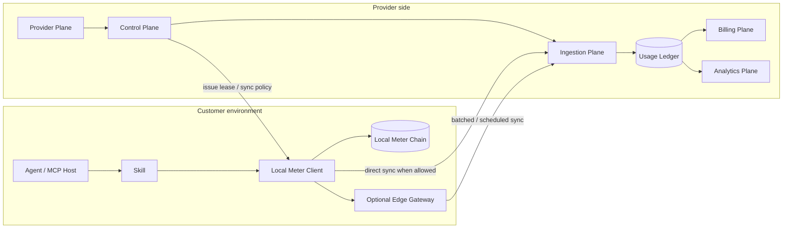
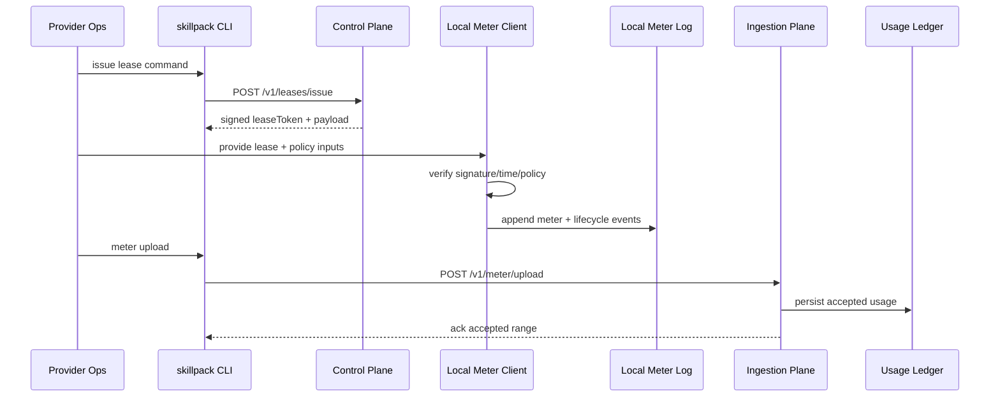
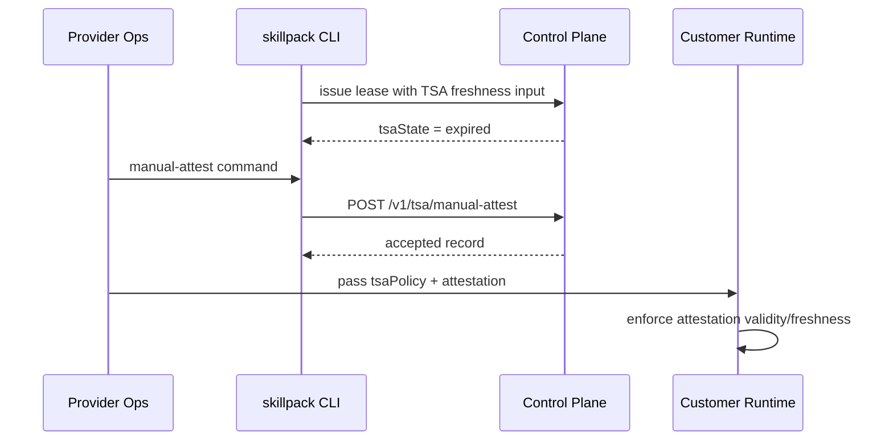
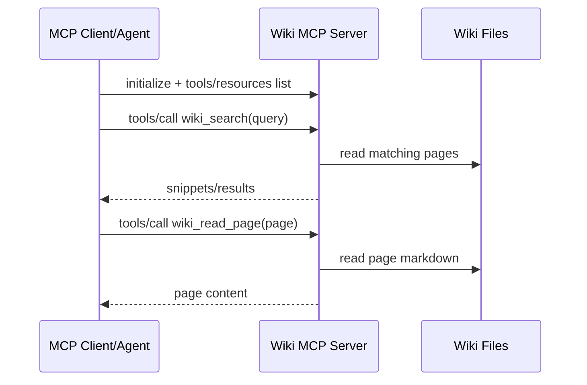

# skillpack (Product Approach + Architecture)

## 0) Reading Order

This doc is the top-down source of truth for the product.

Read in this order:

1. product approach
2. product model
3. high-level architecture
4. system planes
5. trust boundaries and data flow
6. only then implementation details and code

If code and this doc disagree, treat that as an architecture gap to resolve, not a reason to skip product design.

---

## 1) Product Approach

`skillpack` is the control plane for selling and operating vertical AI skills in regulated, disconnected, and customer-controlled environments.

The approach is simple:

- skill providers build the skill
- skillpack wraps it in commercial and operational controls
- customers run the skill locally
- usage is captured offline first, then synced later
- billing and analytics are derived from a server-side usage ledger, not from ad hoc runtime state

This means we always design from the product outward:

- who is selling
- who is buying
- what is being licensed
- what is being metered
- what gets enforced locally
- what becomes system-of-record in the control plane

What we do:

- prove skill provenance
- enforce who can run what and for how long
- capture tamper-evident local usage
- sync usage into a provider-owned ledger
- derive billing, analytics, and operations views from that ledger
- keep operations running during time-source incidents

What we are not:

- not a model provider
- not a chatbot UI company
- not a generic app framework
- not just a signer or license checker

The product is not "a signed bundle". The product is the full operating model around a sellable vertical AI skill.

---

## 2) Product Model

### Core actors

- **Skill Provider**: company selling one or more vertical AI skills
- **Customer**: buyer organization running those skills
- **Workspace**: the commercial and operational unit under a provider/customer relationship
- **Seat**: a specific install, runtime identity, node, or operator-scoped execution target inside a workspace
- **Operator**: human handling provisioning, support, incident response, or sync
- **Agent / MCP Client**: software invoking the skill's tools

### Core product objects

- **Skill**: the provider's packaged vertical capability
- **Bundle**: the signed distributable artifact for a skill release
- **Lease**: time-bounded signed permission to run
- **Policy**: server-authored rules for enablement, time window, and usage budgets
- **Meter Event**: append-only usage or runtime event captured locally
- **Usage Ledger**: server-side durable record of accepted usage events
- **Billing Record**: rated commercial interpretation of ledgered usage

### Canonical IDs

These should be first-class across the product, docs, and storage model:

- `provider_id`
- `customer_id`
- `workspace_id`
- `seat_id`
- `skill_id`
- `bundle_id`
- `lease_id` or `lease_jti`
- `policy_id`
- `tool_name`
- `event_id` or `workspace_id + seat_id + lease_jti + seq`

Rule: metering and billing architecture should be centered on these product identities, not on local file paths or runtime-only counters.

---

## 3) Plain Glossary

- **Skillpack Control Plane**: the hosted platform operated by skillpack. It owns lease, policy, ingest, usage ledger, and vendor-facing operations surfaces. Because the project is open-source, vendors may fork or self-host compatible parts of this stack. The hosted skillpack dashboard can still include premium features.
- **Vendor Self-Host Control Plane**: vendor-operated deployment of the same control-plane responsibilities: lease, policy, ingest, usage ledger, and support workflows.
- **License Server**: the API/service layer inside a control plane that issues and verifies signed permission tokens and owns server-side policy and ledger state.
- **Lease Token**: signed permission ticket with expiry and monotonic counter.
- **TSA**: trusted time source. Used to reason about time freshness in disconnected ops.
- **Manual TSA Attestation**: operator-provided emergency record when TSA freshness is expired.
- **Skill Execution Plane**: the agent, MCP host, or local client that actually uses the skill.
- **Local Meter Client**: bundle-local helper that does local lease/policy checks, meter capture, and sync routing. It does not execute the skill itself.
- **Skillpack Edge Gateway**: optional site-level local service for restricted or offline customer environments. It sits outside `.mcpb`, can serve many skills and machines, and should be versioned and deployed independently from any single skill bundle.
- **Meter Chain**: append-only usage log where each event links to previous hash/HMAC.
- **Usage Ledger**: provider-side database of accepted meter events after sync.
- **Billing**: rating and invoicing layer derived from ledgered usage, not raw runtime files.

---

## 4) High-Level Design

The product has one core job:

1. let providers ship skills into offline customer environments
2. let those skills run in the customer's actual execution environment without requiring a separate per-skill runtime server
3. capture usage locally without requiring constant connectivity
4. sync that usage back into a durable system of record
5. turn that system of record into analytics, billing, and operations workflows

At a high level:

- the skill execution plane is where the skill actually runs, it is the end users' agents
- the local meter client is the edge enforcement and capture point
- the control plane is the source of truth
- the meter log is a transport artifact, not the business database
- billing sits above the usage ledger, not inside the runtime

Deployment shape:

- many `.mcpb` bundles per vendor is normal
- one hosted `skillpack control plane` is normal
- one optional `vendor self-host control plane` is valid
- one optional `Skillpack Edge Gateway` per customer site or network is the right shape when many skills, many agents, or restricted egress must be supported

Design rule:

- put bundle-scoped helper logic inside `.mcpb`
- keep shared site infrastructure outside `.mcpb`
- do not duplicate a local server into every skill bundle

This matters because we support providers with many skills and each skill may expose many tools. The architecture must scale by provider, workspace, seat, skill, and tool without changing the core operating model.

---

## 5) System Planes

### A) Provider Plane

Who uses it:

- skill provider ops
- support
- finance

What it owns:

- provider identity
- skill catalog
- bundle releases
- pricing definitions
- customer/workspace relationships

### B) Skillpack Control Plane

Who uses it:

- vendors using the hosted skillpack platform
- dashboard operators
- automation and support workflows

What it owns:

- hosted API and dashboard
- lease issuance and verification
- policy publication and sync
- attestation persistence
- ingest entrypoints
- provider-side usage ledger

Key principle:

- this is the default hosted control plane operated by us

### C) Vendor Self-Host Control Plane

Who uses it:

- vendor systems
- CLI
- deployment automation

What it owns:

- lease issuance and verification
- policy publication and sync
- TSA / manual attestation records
- ingest entrypoints
- usage ledger and support workflows

Key principle:

- this is the vendor-operated alternative to the hosted skillpack control plane

### D) Skill Execution Plane

Who uses it:

- agent / MCP client
- skill host that actually runs the bundle's tools

What it owns:

- actual skill execution
- tool invocation lifecycle
- skill-facing request/response flow

Key principle:

- this is where the skill runs; it should not depend on a separate required per-skill runtime server

### E) Local Meter Client Plane

Who uses it:

- bundle-local helper code shipped with the skill
- skill execution plane

What it owns:

- local lease and policy cache
- local validation needed for disconnected operation
- local append-only meter capture
- sync routing choice: direct upstream, edge gateway, or local spool

Key principle:

- this is bundle-scoped logic and can live inside `.mcpb`

### F) Edge Gateway Plane

Who uses it:

- customer IT
- restricted-network deployments
- many-skill or many-machine customer sites

What it owns:

- local intake API for many skills and machines
- offline queue or spool
- retry, batching, and scheduled upstream sync
- one approved egress point
- site-level audit and operational state

Key principle:

- the edge gateway is infrastructure, not skill content, so it must stay outside `.mcpb`

### G) Ingestion Plane

Who uses it:

- sync CLI
- upload services
- provider-side ingest jobs

What it owns:

- accepting meter uploads
- authenticating upload requests
- validating envelope and event integrity
- deduplicating and acknowledging accepted usage

Key principle:

- ingestion turns local runtime evidence into server-side accepted records

### H) Ledger Plane

Who uses it:

- analytics
- billing
- support
- audits

What it owns:

- immutable or append-only accepted usage facts
- normalized event identity
- provider/workspace/seat/skill/tool dimensions
- server-side queryability

Key principle:

- this is the product's system of record for usage

### I) Billing Plane

Who uses it:

- provider finance
- dashboard/reporting
- external billing systems

What it owns:

- rating rules
- billable units
- invoice line generation
- reconciliation against ledgered usage

Key principle:

- billing is derived from the ledger, not from runtime state

### G) Analytics Plane

Who uses it:

- provider ops
- customer success
- product

What it owns:

- usage summaries
- tool adoption
- workspace health
- incident and support visibility

Key principle:

- analytics can be lossy or aggregated; the ledger cannot

---

## 6) Bird-Eye Deployment View



### Data location summary

- Lease token and active policy: customer side for enforcement, provider side for issuance history
- Attestation records: control plane storage
- Raw local meter log: customer side
- Accepted usage ledger: provider side database
- Billing records: provider side
- Analytics summaries: provider side

---

## 7) Architecture Boundaries

### What is enforced locally

- lease signature validity
- time/grace rules
- seat/workspace enablement rules
- per-tool usage budget enforcement
- local meter append behavior

### What is authoritative on the server

- latest policy snapshot
- accepted manual attestation records
- lease issuance history and counters
- accepted usage ledger
- billing results
- analytics aggregates

### What is only a transport artifact

- local `meter.jsonl`
- local meter state files
- CLI upload payloads before acceptance

Rule:

- raw local meter files are evidence from the edge, not the final database of record

---

## 8) Meter + Sync Model

The meter flow should be understood as a staged pipeline:

1. local meter client captures usage locally alongside skill execution
2. local events accumulate offline
3. the meter client either syncs directly or hands events to an edge gateway
4. ingestion validates and accepts or rejects them
5. accepted events become usage ledger rows
6. billing and analytics read from the ledger

This is the core architecture for multi-provider and multi-tool support.

### Meter semantics

- billable unit in v1: one increment per tool invocation
- meter event granularity: per tool call, plus runtime lifecycle/supporting events
- meter state is per bundle/seat execution context
- usage budgets are evaluated per seat and tool

### Sync semantics

- sync is explicit and reconnect-oriented
- preferred path is direct upload to a hosted or vendor self-host control plane
- edge gateway is optional and only needed for restricted or offline site networking
- uploads should be idempotent
- acknowledgements should identify what range was accepted
- server-side acceptance should attach provider/workspace/seat/lease context

### Ledger semantics

The ledger should eventually normalize at least:

- provider
- customer
- workspace
- seat
- skill
- bundle
- lease
- tool
- usage unit
- delta
- event time
- ingest time

---

## 9) Multi-Provider / Multi-Tool Design Rules

Because we support many skill providers and each provider may expose many tools:

- provider identity must be first-class in the data model
- skill identity must be first-class in the data model
- tool names are not globally unique without provider/skill context
- pricing must be attachable by provider, skill, and tool
- the same customer may have multiple workspaces
- the same workspace may have multiple seats
- a single provider dashboard should roll up usage by workspace, seat, skill, and tool

Design implication:

- do not collapse the architecture into "one runtime, one log, one summary table"
- separate raw capture, accepted ledger, and commercial billing outputs

---

## 10) Trust and Threat Model

- Runtime trusts signed leases and signed policy inputs.
- Lease counters prevent rewind/regression.
- Manual attestation is required only when TSA freshness is expired.
- Attestation acceptance has freshness and time checks.
- Meter chain detects local tamper edits.
- Server-side ingestion must validate not just event shape but event integrity and replay/gap semantics before treating usage as billable.
- Wiki page reads are bounded to wiki root.

Important product rule:

- "tamper-evident local meter" and "billable accepted usage" are different states in the system

---

## 11) Customer Journey (High Level)

### Persona A: Provider Ops

1. create or manage provider/customer/workspace relationship
2. publish policy and pricing
3. issue lease token
4. deliver skill bundle + token
5. monitor sync, usage, incidents, and support
6. use ledger, analytics, and billing outputs

### Persona B: Customer Runtime Operator

1. deploy one or more skill bundles in the customer environment
2. configure bundle-local meter client for direct sync, vendor sync, or edge gateway mode
3. agent or MCP host uses the skill directly
4. local meter client validates local lease/policy inputs and emits meter events
5. during outage, apply attestation policy input
6. reconnect and upload local usage directly or through the site gateway

### Persona C: Knowledge / Agent Operator

1. start the actual skill host or Wiki MCP server
2. call tools from agent
3. receive results while metering and local enforcement happen alongside execution, not in a separate required runtime service

---

## 12) Component View

| Component | Owns | Does not own |
|---|---|---|
| CLI (`skillpack`) | operator entrypoints, request shaping, upload orchestration, local output JSON | business source of truth |
| Skillpack Control Plane | hosted API, hosted dashboard, lease/policy/ingest/ledger workflows | local skill execution |
| Vendor Self-Host Control Plane | vendor-operated lease/policy/ingest/ledger workflows | local skill execution |
| License Server | lease issuance/verify, policy sync, attestation persistence, ingest entrypoints | local skill execution |
| Local Meter Client | local lease/policy cache, local meter capture, sync routing | actual skill execution |
| Skillpack Edge Gateway | site-level intake, queueing, retry, batching, one egress point for many skills | skill content inside `.mcpb` |
| Crypto + Protocol libs | signing/verify + schema/rule validation | transport and storage policy |
| Usage Ledger store | accepted normalized usage facts | local execution |
| Billing layer | rating and invoice logic | local enforcement |
| Wiki MCP | local wiki tool/resource exposure to agents | commercial control plane |

---

## 13) Contract View

### Control Plane APIs

- `POST /v1/leases/issue`
  - Input: customer/seat/vendor/time params
  - Output: `leaseToken`, `payload`, optional `tsaState`

- `POST /v1/leases/verify`
  - Input: `leaseToken`, `nowSec`
  - Output: `{ valid: true/false, payload|error }`

- `POST /v1/policies/issue`
  - Input: policy snapshot
  - Output: accepted policy

- `POST /v1/policies/sync`
  - Input: workspace identity + optional policy version/id
  - Output: latest policy snapshot or not-modified

- `POST /v1/tsa/manual-attest`
  - Input: customer/seat/operator/ticket/reason/attested time
  - Output: `{ accepted, record }`

- `GET /v1/tsa/manual-attestations/latest?customerId=&seatId=`
  - Output: latest stored attestation record

### Ingestion / Ledger APIs

- `POST /v1/meter/upload`
  - Input: workspace identity + batch of local meter events
  - Output: acceptance result + acknowledged range

- `GET /v1/usage/summary`
  - Output: aggregated view over accepted usage ledger

### CLI commands

- `skillpack license issue ...`
- `skillpack license verify ...`
- `skillpack policy issue ...`
- `skillpack policy sync ...`
- `skillpack meter upload ...`
- `skillpack usage summary ...`
- `skillpack tsa manual-attest ...`
- `skillpack tsa latest-attestation ...`

### Wiki MCP contracts

- MCP methods: `initialize`, `tools/list`, `tools/call`, `resources/list`, `resources/read`
- Tools: `wiki_search`, `wiki_read_page`
- Resources: `wiki://index`, `wiki://page/<slug>`

---

## 14) Interaction View

### A) Normal lease / run / sync path



### B) TSA outage path



### C) Wiki retrieval path



---

## 15) Current Product State

Implemented today:

- core control plane mechanics
- local meter client-side lease and policy enforcement
- local meter capture
- explicit meter upload endpoint
- server-side accepted usage summary
- manual attestation path
- automated unit and journey tests

Still in progress at product level:

1. ~~first-class provider/skill/bundle dimensions in usage storage~~ → shipped (commercial hierarchy API + D1 migration)
2. ~~full accepted-ledger model for multi-provider billing~~ → shipped (meter upload → accepted usage → billing)
3. ~~billing engine / invoice model~~ → shipped (pricing rules, draft invoices, Dodo/Stripe handoffs)
4. ~~dashboard UX layer~~ → shipped (hosted Cloudflare Worker with Clerk auth + billing cockpit)
5. ~~self-hosted Docker image for air-gapped deploys~~ → shipped (`apps/self-hosted`)
6. analytics plane — ledger query/summarization for ops and finance
7. dashboard crypto wiring — `@skillpack/crypto` verify/decode in dashboard UI
8. Vite build pipeline for dashboard (post-LOI)
9. RBAC in dashboard proxy (post-LOI)

---

## 16) Test View

### Contract / Unit Layer

`bun run test:unit`

- validates crypto, protocol rules, server handlers, CLI behavior, local enforcement checks, wiki MCP primitives

### Cross-package Journey Layer

`bun run test:e2e`

- Journey 1: issue / verify / run / meter chain
- Journey 2: TSA-expired -> manual attestation -> local enforcement acceptance
- Journey 3: Wiki MCP stdio query / read path

Current status:

- these flows run locally without a web dev server

---

## 17) Identity, in One Sentence

`skillpack` is the control, ledger, and commercial operations layer that makes vertical AI skills sellable, enforceable, and billable across regulated offline deployments.

---

## 18) Package Structure

**Status: done 2026-04-22. 201/201 tests passed. Now 261/261 tests pass.**

### Completed renames

- `packages/license-server/` → `packages/core/` (`@skillpack/core`)
- `packages/license-server-worker/` → `apps/api/` (`@skillpack/api`)
- `packages/cli/` → `apps/cli/` (`@skillpack/cli`)
- `packages/wiki-mcp/` → `apps/wiki-mcp/` (`@skillpack/wiki-mcp`)
- `listManualAttestations` — filters pushed to SQL
- Ghost `packages/license-server/` directory removed

### Current package layout

```
packages/          pure shared libraries
  core/            @skillpack/core — business logic, storage
  crypto/          @skillpack/crypto — Ed25519 signing
  protocol/        @skillpack/protocol — bundle format + schema
  tsa/             @skillpack/tsa — timestamp authority client
  runtime/         @skillpack/runtime — embedded skill runtime (.mcpb)

apps/              deployable units
  api/             @skillpack/api — CF Worker REST API
  dashboard/       @skillpack/dashboard — CF Worker BFF + Clerk auth UI
  cli/             @skillpack/cli — vendor-side CLI
  self-hosted/     @skillpack/self-hosted — Node shared-key control plane + Docker image
  wiki-mcp/        @skillpack/wiki-mcp — demo wiki MCP server
```

### Multi-worker architecture (current)

```
browser
  └── dashboard worker  (Cloudflare Worker)
        ├── GET /               → serves dashboard HTML/JS/CSS
        ├── GET /app-config     → returns Clerk publishable key + auth mode (unauthenticated)
        ├── GET /assets/*       → static JS + CSS
        └── /api/*  (Clerk-gated or shared-key) → proxies to api worker

api worker  (Cloudflare Worker)
  └── core library
        ├── D1 storage (hosted) or SQLite (self-hosted / air-gapped)
        ├── management auth: shared-key, clerk, or hybrid mode
        └── all management routes gated by x-api-key or Clerk bearer token

self-hosted app  (Node HTTP + Docker)
  └── core library + SQLite
        ├── shared-key management auth only
        └── same `/v1/*` control-plane routes as the hosted worker
```

No Cloudflare Workers Service Bindings in v1 — HTTP proxy is simpler and
works identically in the self-hosted Docker path. Service Bindings (zero-network
hop) are a v2 latency optimization if needed.

### Frontend evolution

Current: vanilla JS embedded as string in `dashboard-ui.js` — zero build step,
works for single-operator internal tooling.

Post-LOI migration path:

1. Add Vite build (`apps/dashboard/vite.config.ts`) → output to `dist/`
2. Cloudflare Workers + Static Assets pattern — same worker, assets from `dist/`
3. Replace vanilla JS with React or Preact + `@clerk/react`
4. Replace `loadScript()` Clerk bootstrap with `<ClerkProvider>` + `<SignIn>`
5. Add TanStack Query for data fetching (replaces manual `proxyFetch` wiring)

Architecture decision to make at that point: Cloudflare Pages vs. Worker +
Static Assets. Pages is simpler for pure SPA; Worker + Assets is better if
the BFF proxy logic needs to stay in the same deploy unit.

### Access control

v1: any Clerk-authenticated user = full management access. Single-operator
model, intentional. Post-LOI: add Clerk organizations/roles, scope proxy
by role claim in `proxyApiRequest`.

### Open items

- [x] Self-hosted Docker image packaging (`apps/self-hosted` as Node HTTP server)
- [ ] Dashboard Vite build pipeline (post-LOI)
- [ ] RBAC in dashboard proxy (post-LOI)
- [ ] Semi-detached dashboard crypto: wire `@skillpack/crypto` verify/decode into dashboard UI (dep added, UI wiring deferred)
- [ ] Analytics plane — usage ledger query/summarization
