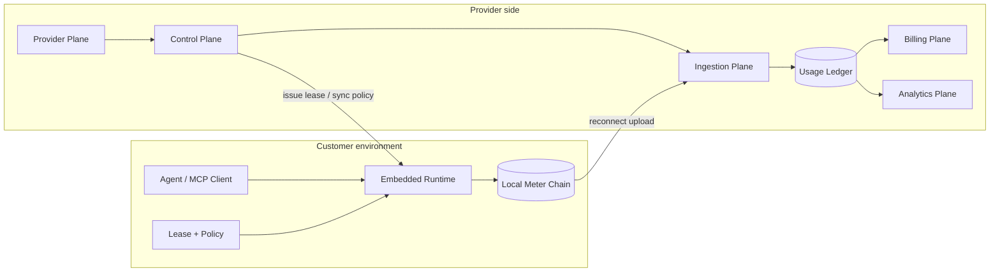
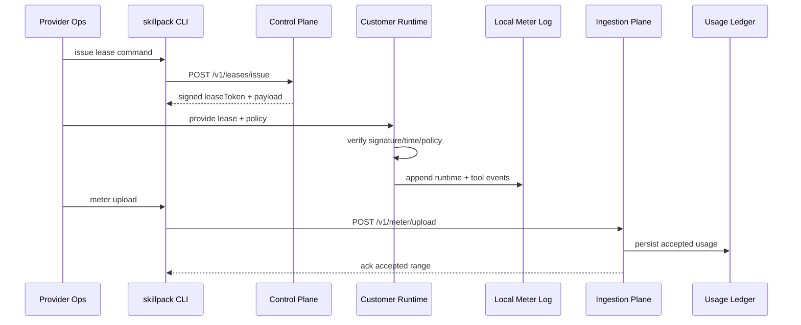
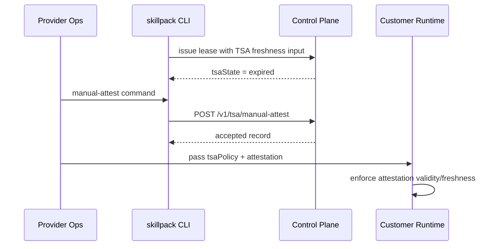
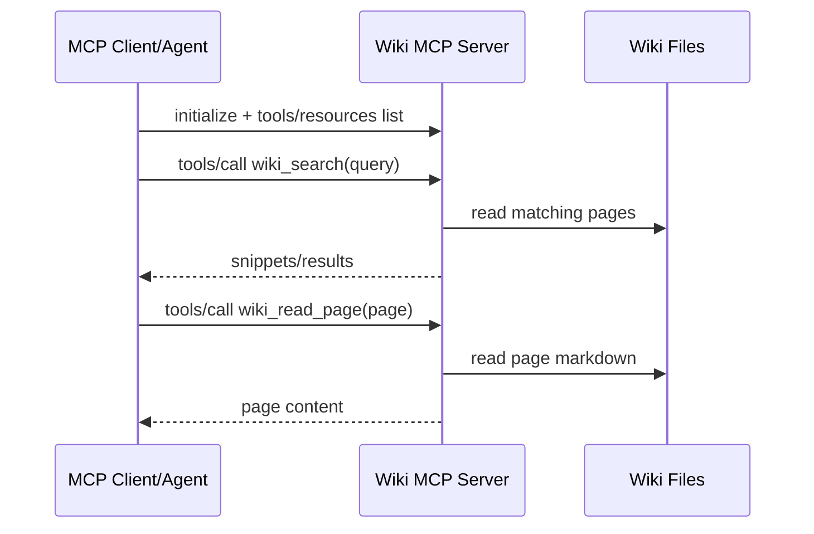

# skillpack (Product Approach + Architecture)

## 0) Reading Order

This doc is the top-down source of truth for the product.

Read in this order:

1. product approach
2. product model
3. high-level architecture
4. system planes
5. trust boundaries and data flow
6. only then implementation details and code

If code and this doc disagree, treat that as an architecture gap to resolve, not a reason to skip product design.

---

## 1) Product Approach

`skillpack` is the control plane for selling and operating vertical AI skills in regulated, disconnected, and customer-controlled environments.

The approach is simple:

- skill providers build the skill
- skillpack wraps it in commercial and operational controls
- customers run the skill locally
- usage is captured offline first, then synced later
- billing and analytics are derived from a server-side usage ledger, not from ad hoc runtime state

This means we always design from the product outward:

- who is selling
- who is buying
- what is being licensed
- what is being metered
- what gets enforced locally
- what becomes system-of-record in the control plane

What we do:

- prove skill provenance
- enforce who can run what and for how long
- capture tamper-evident local usage
- sync usage into a provider-owned ledger
- derive billing, analytics, and operations views from that ledger
- keep operations running during time-source incidents

What we are not:

- not a model provider
- not a chatbot UI company
- not a generic app framework
- not just a signer or license checker

The product is not "a signed bundle". The product is the full operating model around a sellable vertical AI skill.

---

## 2) Product Model

### Core actors

- **Skill Provider**: company selling one or more vertical AI skills
- **Customer**: buyer organization running those skills
- **Workspace**: the commercial and operational unit under a provider/customer relationship
- **Seat**: a specific install, runtime identity, node, or operator-scoped execution target inside a workspace
- **Operator**: human handling provisioning, support, incident response, or sync
- **Agent / MCP Client**: software invoking the skill's tools

### Core product objects

- **Skill**: the provider's packaged vertical capability
- **Bundle**: the signed distributable artifact for a skill release
- **Lease**: time-bounded signed permission to run
- **Policy**: server-authored rules for enablement, time window, and usage budgets
- **Meter Event**: append-only usage or runtime event captured locally
- **Usage Ledger**: server-side durable record of accepted usage events
- **Billing Record**: rated commercial interpretation of ledgered usage

### Canonical IDs

These should be first-class across the product, docs, and storage model:

- `provider_id`
- `customer_id`
- `workspace_id`
- `seat_id`
- `skill_id`
- `bundle_id`
- `lease_id` or `lease_jti`
- `policy_id`
- `tool_name`
- `event_id` or `workspace_id + seat_id + lease_jti + seq`

Rule: metering and billing architecture should be centered on these product identities, not on local file paths or runtime-only counters.

---

## 3) Plain Glossary

- **License Server**: service that issues and verifies signed permission tokens and owns server-side policy and ledger state.
- **Lease Token**: signed permission ticket with expiry and monotonic counter.
- **TSA**: trusted time source. Used to reason about time freshness in disconnected ops.
- **Manual TSA Attestation**: operator-provided emergency record when TSA freshness is expired.
- **Meter Chain**: append-only usage log where each event links to previous hash/HMAC.
- **Usage Ledger**: provider-side database of accepted meter events after sync.
- **Billing**: rating and invoicing layer derived from ledgered usage, not raw runtime files.

---

## 4) High-Level Design

The product has one core job:

1. let providers ship skills into offline customer environments
2. let those skills run under local enforcement
3. capture usage locally without requiring constant connectivity
4. sync that usage back into a durable system of record
5. turn that system of record into analytics, billing, and operations workflows

At a high level:

- the runtime is the edge enforcement point
- the control plane is the source of truth
- the meter log is a transport artifact, not the business database
- billing sits above the usage ledger, not inside the runtime

This matters because we support providers with many skills and each skill may expose many tools. The architecture must scale by provider, workspace, seat, skill, and tool without changing the core operating model.

---

## 5) System Planes

### A) Provider Plane

Who uses it:

- skill provider ops
- support
- finance

What it owns:

- provider identity
- skill catalog
- bundle releases
- pricing definitions
- customer/workspace relationships

### B) Control Plane

Who uses it:

- provider systems
- CLI
- deployment automation

What it owns:

- lease issuance and verification
- policy publication and sync
- revocation semantics
- TSA / manual attestation records

Key principle:

- the control plane decides what is allowed

### C) Runtime Plane

Who uses it:

- customer-side local runtime
- agent / MCP client

What it owns:

- local lease validation
- local policy enforcement
- local tool execution
- local append-only meter capture

Key principle:

- the runtime must continue operating safely when disconnected

### D) Ingestion Plane

Who uses it:

- sync CLI
- upload services
- provider-side ingest jobs

What it owns:

- accepting meter uploads
- authenticating upload requests
- validating envelope and event integrity
- deduplicating and acknowledging accepted usage

Key principle:

- ingestion turns local runtime evidence into server-side accepted records

### E) Ledger Plane

Who uses it:

- analytics
- billing
- support
- audits

What it owns:

- immutable or append-only accepted usage facts
- normalized event identity
- provider/workspace/seat/skill/tool dimensions
- server-side queryability

Key principle:

- this is the product's system of record for usage

### F) Billing Plane

Who uses it:

- provider finance
- dashboard/reporting
- external billing systems

What it owns:

- rating rules
- billable units
- invoice line generation
- reconciliation against ledgered usage

Key principle:

- billing is derived from the ledger, not from runtime state

### G) Analytics Plane

Who uses it:

- provider ops
- customer success
- product

What it owns:

- usage summaries
- tool adoption
- workspace health
- incident and support visibility

Key principle:

- analytics can be lossy or aggregated; the ledger cannot

---

## 6) Bird-Eye Deployment View

### Data location summary

- Lease token and active policy: customer side for enforcement, provider side for issuance history
- Attestation records: control plane storage
- Raw local meter log: customer side
- Accepted usage ledger: provider side database
- Billing records: provider side
- Analytics summaries: provider side

---

## 7) Architecture Boundaries

### What is enforced locally

- lease signature validity
- time/grace rules
- seat/workspace enablement rules
- per-tool usage budget enforcement
- local meter append behavior

### What is authoritative on the server

- latest policy snapshot
- accepted manual attestation records
- lease issuance history and counters
- accepted usage ledger
- billing results
- analytics aggregates

### What is only a transport artifact

- local `meter.jsonl`
- local meter state files
- CLI upload payloads before acceptance

Rule:

- raw local meter files are evidence from the edge, not the final database of record

---

## 8) Meter + Sync Model

The meter flow should be understood as a staged pipeline:

1. runtime captures usage locally
2. local events accumulate offline
3. operator or sync agent uploads events
4. ingestion validates and accepts or rejects them
5. accepted events become usage ledger rows
6. billing and analytics read from the ledger

This is the core architecture for multi-provider and multi-tool support.

### Meter semantics

- billable unit in v1: one increment per tool invocation
- meter event granularity: per tool call, plus runtime lifecycle/supporting events
- meter state is per runtime/seat execution context
- usage budgets are evaluated per seat and tool

### Sync semantics

- sync is explicit and reconnect-oriented
- uploads should be idempotent
- acknowledgements should identify what range was accepted
- server-side acceptance should attach provider/workspace/seat/lease context

### Ledger semantics

The ledger should eventually normalize at least:

- provider
- customer
- workspace
- seat
- skill
- bundle
- lease
- tool
- usage unit
- delta
- event time
- ingest time

---

## 9) Multi-Provider / Multi-Tool Design Rules

Because we support many skill providers and each provider may expose many tools:

- provider identity must be first-class in the data model
- skill identity must be first-class in the data model
- tool names are not globally unique without provider/skill context
- pricing must be attachable by provider, skill, and tool
- the same customer may have multiple workspaces
- the same workspace may have multiple seats
- a single provider dashboard should roll up usage by workspace, seat, skill, and tool

Design implication:

- do not collapse the architecture into "one runtime, one log, one summary table"
- separate raw capture, accepted ledger, and commercial billing outputs

---

## 10) Trust and Threat Model

- Runtime trusts signed leases and signed policy inputs.
- Lease counters prevent rewind/regression.
- Manual attestation is required only when TSA freshness is expired.
- Attestation acceptance has freshness and time checks.
- Meter chain detects local tamper edits.
- Server-side ingestion must validate not just event shape but event integrity and replay/gap semantics before treating usage as billable.
- Wiki page reads are bounded to wiki root.

Important product rule:

- "tamper-evident local meter" and "billable accepted usage" are different states in the system

---

## 11) Customer Journey (High Level)

### Persona A: Provider Ops

1. create or manage provider/customer/workspace relationship
2. publish policy and pricing
3. issue lease token
4. deliver skill bundle + token
5. monitor sync, usage, incidents, and support
6. use ledger, analytics, and billing outputs

### Persona B: Customer Runtime Operator

1. deploy runtime + skill in customer environment
2. runtime validates lease locally
3. skill executes and emits meter events
4. during outage, apply attestation policy input
5. reconnect and upload local usage

### Persona C: Knowledge / Agent Operator

1. start local skill runtime or Wiki MCP server
2. call tools from agent
3. receive results under local policy and license enforcement

---

## 12) Component View

| Component | Owns | Does not own |
|---|---|---|
| CLI (`skillpack`) | operator entrypoints, request shaping, upload orchestration, local output JSON | business source of truth |
| License Server | lease issuance/verify, policy sync, attestation persistence, ingest entrypoints | local runtime execution |
| Runtime | offline enforcement, grace behavior, local tool execution, local meter capture | provider billing state |
| Crypto + Protocol libs | signing/verify + schema/rule validation | transport and storage policy |
| Usage Ledger store | accepted normalized usage facts | local execution |
| Billing layer | rating and invoice logic | local enforcement |
| Wiki MCP | local wiki tool/resource exposure to agents | commercial control plane |

---

## 13) Contract View

### Control Plane APIs

- `POST /v1/leases/issue`
  - Input: customer/seat/vendor/time params
  - Output: `leaseToken`, `payload`, optional `tsaState`

- `POST /v1/leases/verify`
  - Input: `leaseToken`, `nowSec`
  - Output: `{ valid: true/false, payload|error }`

- `POST /v1/policies/issue`
  - Input: policy snapshot
  - Output: accepted policy

- `POST /v1/policies/sync`
  - Input: workspace identity + optional policy version/id
  - Output: latest policy snapshot or not-modified

- `POST /v1/tsa/manual-attest`
  - Input: customer/seat/operator/ticket/reason/attested time
  - Output: `{ accepted, record }`

- `GET /v1/tsa/manual-attestations/latest?customerId=&seatId=`
  - Output: latest stored attestation record

### Ingestion / Ledger APIs

- `POST /v1/meter/upload`
  - Input: workspace identity + batch of local meter events
  - Output: acceptance result + acknowledged range

- `GET /v1/usage/summary`
  - Output: aggregated view over accepted usage ledger

### CLI commands

- `skillpack license issue ...`
- `skillpack license verify ...`
- `skillpack policy issue ...`
- `skillpack policy sync ...`
- `skillpack meter upload ...`
- `skillpack usage summary ...`
- `skillpack tsa manual-attest ...`
- `skillpack tsa latest-attestation ...`

### Wiki MCP contracts

- MCP methods: `initialize`, `tools/list`, `tools/call`, `resources/list`, `resources/read`
- Tools: `wiki_search`, `wiki_read_page`
- Resources: `wiki://index`, `wiki://page/<slug>`

---

## 14) Interaction View

### A) Normal lease / run / sync path

### B) TSA outage path

### C) Wiki retrieval path

---

## 15) Current Product State

Implemented today:

- core control plane mechanics
- runtime-side lease and policy enforcement
- local meter capture
- explicit meter upload endpoint
- server-side accepted usage summary
- manual attestation path
- automated unit and journey tests

Not yet complete at product level:

1. first-class provider/skill/bundle dimensions in usage storage
2. full accepted-ledger model for multi-provider billing
3. billing engine / invoice model
4. dashboard UX layer
5. packaging and release workflows at full product level

---

## 16) Test View

### Contract / Unit Layer

`bun run test:unit`

- validates crypto, protocol rules, server handlers, CLI behavior, runtime checks, wiki MCP primitives

### Cross-package Journey Layer

`bun run test:e2e`

- Journey 1: issue / verify / run / meter chain
- Journey 2: TSA-expired -> manual attestation -> runtime acceptance
- Journey 3: Wiki MCP stdio query / read path

Current status:

- these flows run locally without a web dev server

---

## 17) Identity, in One Sentence

`skillpack` is the control, ledger, and commercial operations layer that makes vertical AI skills sellable, enforceable, and billable across regulated offline deployments.
