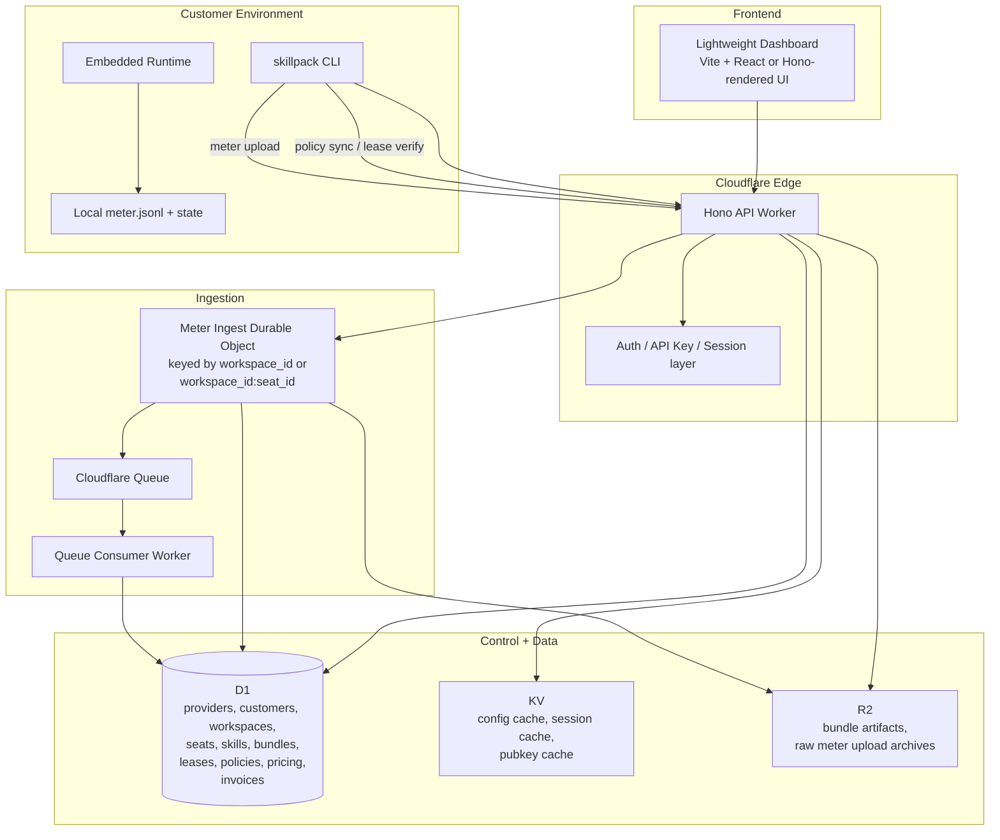

# Backend Architecture

## Goal

Define the backend wiring for `skillpack` as a product that supports:

- many skill providers
- many skills per provider
- many tools per skill
- offline metering
- policy sync
- usage ledgering
- billing and analytics

This doc is top-down. It describes the approach, system planes, service wiring, and data model before implementation detail.

---

## Stack Decision

Preferred stack:

- `Bun` for local development, CLI, scripts, tests, and shared TypeScript packages
- `Hono` for the API framework
- `Cloudflare Workers` for edge compute
- `Cloudflare D1` for relational product state and accepted usage ledger
- `Cloudflare Durable Objects` for ordered meter ingestion
- `Cloudflare Queues` for async aggregation and billing work
- `Cloudflare R2` for raw meter uploads and bundle artifacts
- `Cloudflare KV` for cache only

This stack fits the product shape:

- lightweight to operate
- edge-native
- good fit for control-plane APIs
- good fit for reconnect-oriented usage ingestion

---

## Product-Level Rule

Do not let billing read runtime logs directly.

Authoritative path:

`runtime local meter -> upload -> ingestion accept/reject -> accepted usage ledger -> billing`

This is the backbone of the product.

---

## System Planes to Services Mapping

| Product Plane | Primary Service |
|---|---|
| Provider Plane | Hono API Worker + D1 |
| Control Plane | Hono API Worker + D1 |
| Runtime Plane | local runtime |
| Ingestion Plane | Hono API Worker (synchronous, Durable Objects post-LOI) |
| Ledger Plane | D1 |
| Billing Plane | D1 (pricing rules, invoices, payment handoffs) |
| Analytics Plane | D1 rollups, later dedicated analytics if needed |

---

## Recommended v1 Service Topology



---

## Service Responsibilities

### 1) Hono API Worker

Owns:

- auth
- provider/customer/workspace APIs
- lease issue/verify
- policy publish/sync
- meter upload entrypoint
- usage summary APIs
- invoice/admin APIs

Why:

- one coherent edge API surface
- simple deployment model
- natural fit for control-plane endpoints

### 2) Durable Object Ingest Coordinator

Owns:

- ordered acceptance of meter uploads
- idempotency
- duplicate detection
- gap detection
- chain continuity checks
- stream checkpoint state

Recommended key:

- `workspace_id:seat_id` if streams are seat-scoped
- `workspace_id` only if ordering must be global across seats

Recommendation:

- start with `workspace_id:seat_id`

Why:

- metering correctness is a stateful coordination problem
- this is the hardest backend problem in the product

### 3) Queue Consumer

Owns:

- usage rollups
- invoice line candidate generation
- anomaly checks
- notifications or webhooks later

Why:

- keeps ingest latency low
- separates acceptance from derived state

### 4) D1

Owns:

- relational control-plane state
- accepted usage ledger
- billing state
- dashboard query state

Why:

- enough for v1
- lower ops burden
- good fit for product queries and joins

### 5) R2

Owns:

- bundle artifacts
- raw upload blobs
- audit and reprocessing inputs

Why:

- cheap object storage
- preserves original evidence from the edge

### 6) KV

Owns:

- cache only

Examples:

- session cache
- provider config cache
- public key cache
- feature flags

Rule:

- KV is not usage truth
- KV is not billing truth

---

## Request and Data Flow

### Normal control-plane flow

1. provider UI or CLI calls the Hono API Worker
2. Worker authenticates the request
3. Worker reads or writes control-plane state in D1
4. Worker returns a synchronous response

### Meter upload flow

1. runtime writes local meter events offline
2. CLI uploads an event batch to `/v1/meter/upload`
3. API Worker authenticates and routes the batch to the correct Durable Object
4. Durable Object validates the stream
5. raw upload is archived to R2
6. accepted normalized events are persisted to D1
7. Durable Object emits queue messages for async downstream work
8. consumer updates rollups and invoice candidates in D1

### Billing flow

1. consumer reads accepted usage events or rollups
2. pricing rules are applied
3. invoice lines are generated
4. invoices become queryable in the API and dashboard

---

## Data Model Principles

The schema must be centered on product identity, not runtime accident.

First-class dimensions:

- provider
- customer
- workspace
- seat
- skill
- bundle
- lease
- policy
- tool
- event

Do not model the product as:

- one log file
- one summary table
- one runtime-centric meter store

Separate:

- raw upload evidence
- accepted usage ledger
- billing outputs

---

## D1 Schema

```sql
CREATE TABLE providers (
  id TEXT PRIMARY KEY,
  slug TEXT NOT NULL UNIQUE,
  name TEXT NOT NULL,
  created_at TEXT NOT NULL
);

CREATE TABLE customers (
  id TEXT PRIMARY KEY,
  provider_id TEXT NOT NULL,
  external_ref TEXT,
  name TEXT NOT NULL,
  created_at TEXT NOT NULL,
  FOREIGN KEY (provider_id) REFERENCES providers(id)
);

CREATE TABLE workspaces (
  id TEXT PRIMARY KEY,
  provider_id TEXT NOT NULL,
  customer_id TEXT NOT NULL,
  name TEXT NOT NULL,
  status TEXT NOT NULL,
  created_at TEXT NOT NULL,
  FOREIGN KEY (provider_id) REFERENCES providers(id),
  FOREIGN KEY (customer_id) REFERENCES customers(id)
);

CREATE TABLE seats (
  id TEXT PRIMARY KEY,
  workspace_id TEXT NOT NULL,
  external_ref TEXT,
  status TEXT NOT NULL,
  created_at TEXT NOT NULL,
  FOREIGN KEY (workspace_id) REFERENCES workspaces(id)
);

CREATE TABLE skills (
  id TEXT PRIMARY KEY,
  provider_id TEXT NOT NULL,
  slug TEXT NOT NULL,
  name TEXT NOT NULL,
  status TEXT NOT NULL,
  created_at TEXT NOT NULL,
  UNIQUE (provider_id, slug),
  FOREIGN KEY (provider_id) REFERENCES providers(id)
);

CREATE TABLE bundles (
  id TEXT PRIMARY KEY,
  provider_id TEXT NOT NULL,
  skill_id TEXT NOT NULL,
  version TEXT NOT NULL,
  artifact_r2_key TEXT NOT NULL,
  manifest_sha256 TEXT NOT NULL,
  signature_r2_key TEXT,
  created_at TEXT NOT NULL,
  UNIQUE (skill_id, version),
  FOREIGN KEY (provider_id) REFERENCES providers(id),
  FOREIGN KEY (skill_id) REFERENCES skills(id)
);

CREATE TABLE leases (
  id TEXT PRIMARY KEY,
  provider_id TEXT NOT NULL,
  workspace_id TEXT NOT NULL,
  seat_id TEXT,
  skill_id TEXT NOT NULL,
  bundle_id TEXT,
  lease_jti TEXT NOT NULL UNIQUE,
  lease_counter INTEGER NOT NULL,
  status TEXT NOT NULL,
  issued_at_sec INTEGER NOT NULL,
  expires_at_sec INTEGER NOT NULL,
  created_at TEXT NOT NULL,
  FOREIGN KEY (provider_id) REFERENCES providers(id),
  FOREIGN KEY (workspace_id) REFERENCES workspaces(id),
  FOREIGN KEY (seat_id) REFERENCES seats(id),
  FOREIGN KEY (skill_id) REFERENCES skills(id),
  FOREIGN KEY (bundle_id) REFERENCES bundles(id)
);

CREATE TABLE policy_snapshots (
  id TEXT PRIMARY KEY,
  provider_id TEXT NOT NULL,
  workspace_id TEXT NOT NULL,
  skill_id TEXT,
  policy_id TEXT NOT NULL,
  policy_version INTEGER NOT NULL,
  snapshot_json TEXT NOT NULL,
  active INTEGER NOT NULL DEFAULT 1,
  created_at TEXT NOT NULL,
  UNIQUE (workspace_id, policy_id),
  FOREIGN KEY (provider_id) REFERENCES providers(id),
  FOREIGN KEY (workspace_id) REFERENCES workspaces(id),
  FOREIGN KEY (skill_id) REFERENCES skills(id)
);

CREATE TABLE pricing_rules (
  id TEXT PRIMARY KEY,
  provider_id TEXT NOT NULL,
  skill_id TEXT,
  tool_name TEXT,
  unit TEXT NOT NULL,
  price_nanos INTEGER NOT NULL,
  currency TEXT NOT NULL,
  effective_from TEXT NOT NULL,
  effective_to TEXT,
  created_at TEXT NOT NULL,
  FOREIGN KEY (provider_id) REFERENCES providers(id),
  FOREIGN KEY (skill_id) REFERENCES skills(id)
);

CREATE TABLE meter_stream_state (
  stream_key TEXT PRIMARY KEY,
  provider_id TEXT NOT NULL,
  workspace_id TEXT NOT NULL,
  seat_id TEXT,
  lease_jti TEXT,
  last_seq INTEGER NOT NULL,
  last_hash TEXT NOT NULL,
  last_event_at_sec INTEGER NOT NULL,
  updated_at TEXT NOT NULL
);

CREATE TABLE raw_meter_uploads (
  id TEXT PRIMARY KEY,
  provider_id TEXT NOT NULL,
  workspace_id TEXT NOT NULL,
  seat_id TEXT,
  upload_r2_key TEXT NOT NULL,
  received_at TEXT NOT NULL,
  event_count INTEGER NOT NULL,
  seq_start INTEGER,
  seq_end INTEGER
);

CREATE TABLE accepted_usage_events (
  id TEXT PRIMARY KEY,
  provider_id TEXT NOT NULL,
  customer_id TEXT NOT NULL,
  workspace_id TEXT NOT NULL,
  seat_id TEXT,
  skill_id TEXT,
  bundle_id TEXT,
  lease_id TEXT,
  lease_jti TEXT,
  policy_snapshot_id TEXT,
  tool_name TEXT NOT NULL,
  event_kind TEXT NOT NULL,
  usage_unit TEXT NOT NULL,
  usage_delta REAL NOT NULL,
  event_seq INTEGER NOT NULL,
  event_hash TEXT NOT NULL,
  prev_hash TEXT NOT NULL,
  event_at_sec INTEGER NOT NULL,
  ingested_at TEXT NOT NULL,
  raw_upload_id TEXT,
  UNIQUE (workspace_id, seat_id, lease_jti, event_seq),
  FOREIGN KEY (provider_id) REFERENCES providers(id),
  FOREIGN KEY (customer_id) REFERENCES customers(id),
  FOREIGN KEY (workspace_id) REFERENCES workspaces(id),
  FOREIGN KEY (seat_id) REFERENCES seats(id),
  FOREIGN KEY (skill_id) REFERENCES skills(id),
  FOREIGN KEY (bundle_id) REFERENCES bundles(id),
  FOREIGN KEY (lease_id) REFERENCES leases(id),
  FOREIGN KEY (raw_upload_id) REFERENCES raw_meter_uploads(id)
);

CREATE TABLE usage_rollups_daily (
  id TEXT PRIMARY KEY,
  provider_id TEXT NOT NULL,
  workspace_id TEXT NOT NULL,
  seat_id TEXT,
  skill_id TEXT,
  tool_name TEXT NOT NULL,
  usage_unit TEXT NOT NULL,
  usage_date TEXT NOT NULL,
  total_delta REAL NOT NULL,
  UNIQUE (provider_id, workspace_id, seat_id, skill_id, tool_name, usage_unit, usage_date)
);

CREATE TABLE invoices (
  id TEXT PRIMARY KEY,
  provider_id TEXT NOT NULL,
  customer_id TEXT NOT NULL,
  period_start TEXT NOT NULL,
  period_end TEXT NOT NULL,
  currency TEXT NOT NULL,
  status TEXT NOT NULL,
  subtotal_nanos INTEGER NOT NULL,
  created_at TEXT NOT NULL,
  FOREIGN KEY (provider_id) REFERENCES providers(id),
  FOREIGN KEY (customer_id) REFERENCES customers(id)
);

CREATE TABLE invoice_lines (
  id TEXT PRIMARY KEY,
  invoice_id TEXT NOT NULL,
  provider_id TEXT NOT NULL,
  workspace_id TEXT,
  skill_id TEXT,
  tool_name TEXT,
  usage_unit TEXT NOT NULL,
  quantity REAL NOT NULL,
  unit_price_nanos INTEGER NOT NULL,
  line_total_nanos INTEGER NOT NULL,
  period_start TEXT NOT NULL,
  period_end TEXT NOT NULL,
  created_at TEXT NOT NULL,
  FOREIGN KEY (invoice_id) REFERENCES invoices(id),
  FOREIGN KEY (provider_id) REFERENCES providers(id)
);
```

---

## Why This Schema

- `providers`, `customers`, `workspaces`, `seats`: commercial hierarchy
- `skills`, `bundles`: product hierarchy
- `leases`, `policy_snapshots`: control plane
- `meter_stream_state`: ingest checkpoint and ordering state
- `raw_meter_uploads`: audit evidence
- `accepted_usage_events`: billable usage ledger
- `usage_rollups_daily`: fast dashboard queries
- `pricing_rules`, `invoices`, `invoice_lines`: billing outputs

---

## v1 API Surface

- `POST /v1/providers/:providerId/customers`
- `POST /v1/workspaces`
- `POST /v1/leases/issue`
- `POST /v1/leases/verify`
- `POST /v1/policies/issue`
- `POST /v1/policies/sync`
- `POST /v1/meter/upload`
- `GET /v1/usage/summary`
- `GET /v1/invoices`
- `GET /v1/invoices/:id`

---

## Frontend Guidance

Keep the frontend lightweight.

Recommended:

- `Vite + React`
- minimal component surface
- data-table and admin-style product UI
- no heavy framework unless needed

Visual direction:

- lightweight
- no-frills
- current and sharp
- operational, not marketing-heavy

The frontend should be a thin layer over the control plane and ledger, not its own architecture.

---

## Recommendation

For v1, build one backend:

- one Hono Worker app
- one Durable Object namespace for ingest coordination
- one Queue consumer
- one D1 database
- one R2 bucket for artifacts and raw uploads
- one KV namespace for cache

This is enough to be real without becoming bloated.
